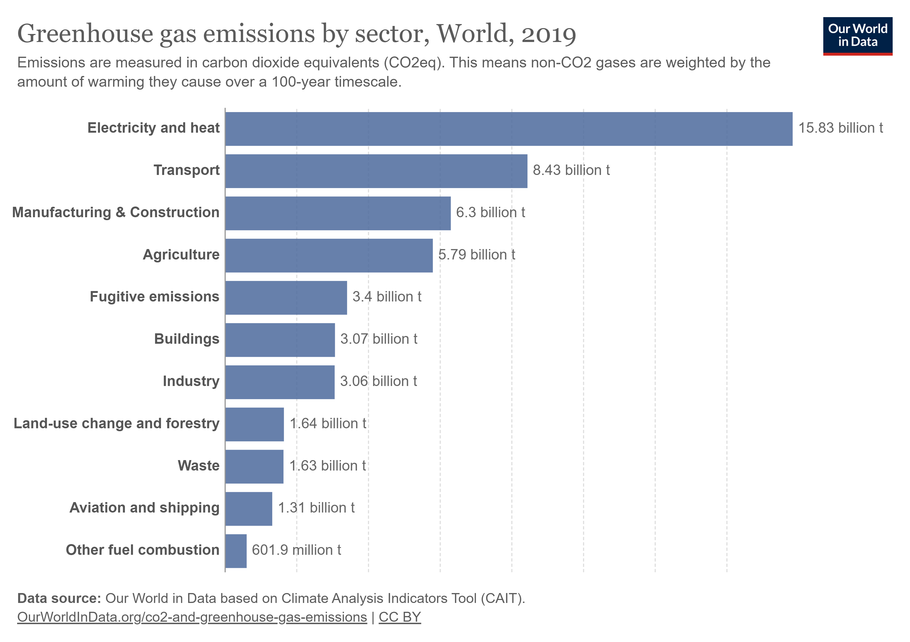
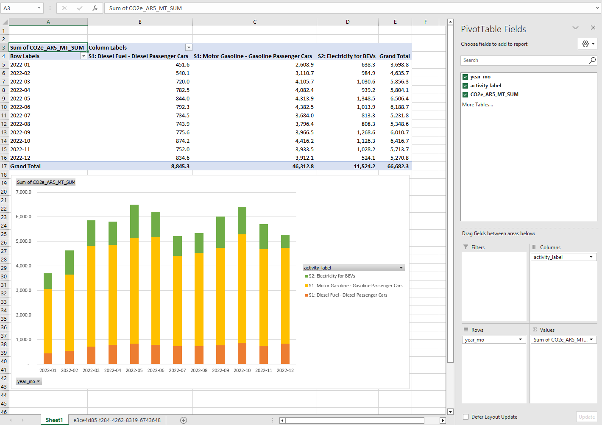
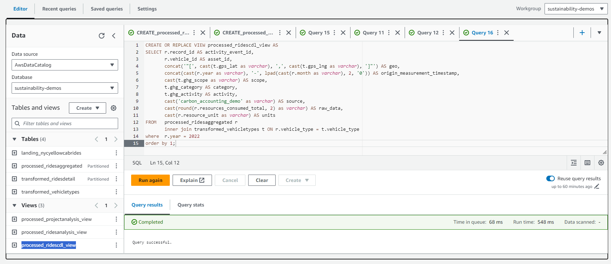

# Demo 01: Cloud-scale Fleet Emissions Estimates via Core AWS Services and AWS Carbon Data Lake

**Demo Sections...**
* [Overview](#overview)
* [Section 01: S3 Bucket Setup and Source Data Transfer to LANDING Zone](#section-01-s3-bucket-setup-and-source-data-transfer-to-landing-zone)
* [Section 02: Setting Up Landing Zone Data Resources](#section-02-setting-up-landing-zone-data-resources)
* [Section 03: Creating Transformed Zone Lookup Table and Rides Data](#section-03-creating-transformed-zone-lookup-table-and-rides-data)
* [Section 04: Creating Processed Zone Aggregated Rides Data](#section-04-creating-processed-zone-aggregated-rides-data)
* [Section 05: Using AWS Carbon Data Lake (CDL) for Emissions Estimates](#section-05-using-aws-carbon-data-lake-cdl-for-emissions-estimates)
* [Connect...](#connect)

## Overview

Transportation is the second leading cause of global greenhouse gas (GHG) emissions accounting for 8.43 billion MT of carbon dioxide equivalent emissions (CO2e), behind only electricity and heat generation. Most of the transportation emissions are attributable to road transportation from cars and trucks. Fleet managers responsible for large fleets need to understand their fleet emissions and how to potentially cut carbon and costs from these fleets over time. The growing transition from fossil fuel based vehicles towards battery-electric vehicles (BEV) will help reduce emissions and drive down operational costs over time. Fleet managers should look to evaluate the expected benefits of potential fleet decarbonization projects as they relate to quantifiable carbon and cost reduction.

This carbon accounting demo will work through a scenario that processes a massive fleet dataset to understand carbon and cost tradeoffs and how one might estimate the benefits of potential fleet decarbonization projects.

[](https://ourworldindata.org/emissions-by-sector)

### Demo Scenario: Situation, Task, Actions, Results, and Impact...
**Situation:** Imagine we run a massive fleet organization (eg: NYC YellowCab) and want to analyze fleet characteristics by vehicle types, efficiency differences, fuel costs, and carbon dioxide (CO2) emissions.\
**Task:** Use the open-source New York City YellowCab ride records for 2022 (~39M rides) to create a multi-stage data lake that prepares data for analysis.\
**Actions:** Copy relevant 2022 YellowCab data to our LANDING zone, run a transformation to supplement data within our TRANSFORMED zone, and create an aggregated dataset for analysis within our PROCESSED zone. Finally, perform ad-hoc analysis queries and optionally run our aggregated ride activity data through AWS Carbon Data Lake for emissions calculations.\
**Results:** A simplified, aggregated dataset that is quick and inexpensive to query to gain insights on fleet efficiency characteristics and how to quantify potential fleet decarbonization improvements.

**Impact:** Costs and carbon analysis capabilities to show key business metrics and quantify expected cost and carbon savings of potential fleet optimization projects. If using AWS Carbon Data Lake, we also get automated data flows, quality checks, data lineage, and emissions calculations.

Here are example Excel visualizations for some of the analytics you can visualize by the end of this demo.




**Technical Prerequisites:** Authenticated access into an AWS account with Administrator or similarly broad permissions to perform the actions in this demo, including those necessary to create Amazon S3 Buckets, use AWS Glue, use Amazon Athena, and deploy AWS Carbon Data Lake resources.\
(See the [GitHub repo for AWS Carbon Data Lake](https://github.com/aws-solutions-library-samples/guidance-for-carbon-data-lake-on-aws) for details on that solution guidance.)

**Experience Prerequisites:** Familiarity with AWS, common AWS services, navigating the AWS Console, and similar abilities.

**Demo Architecture Created...**


**Expected Costs and Other Notes**
Performing the steps in this demo will result in costs expected to be less than $1. This demo is for instructional purposes only and the open-source NYC YellowCab data is augmented with fictitious vehicle data for the purposes of the demo.

## Section 01: S3 Bucket Setup and Source Data Transfer to LANDING Zone
**Source Data:** New York City YellowCab ride records for 2022\
**Source Location:** [Amazon Sustainability Data Initiative (ASDI) S3 Bucket](https://s3.console.aws.amazon.com/s3/buckets/nyc-tlc?region=us-east-1&prefix=trip+data/) (use prefix: yellow_tripdata_2022)\
**Target Data:** Create a simple data lake with zones for: LANDING, TRANSFORMED, and PROCESSED

### Step 01-A: Log Into Account and Choose Region
Log into your AWS account and pick a region to use for this demo. The NYC YellowCab source data is located in us-east-1 and choosing that data will minimize data transfer, although we're only focused on ~587MB of data from 2022 and ASDI will cover data egress fees if you need to choose a region other than us-east-1.

Note that screenshots for this demo will use us-west-2.

### Step 01-B: Create Target Bucket

* Navigate to the [AWS S3 Console Create bucket](https://s3.console.aws.amazon.com/s3/bucket/create) screen.
* Enter your desired bucket name, leave other defaults as-is, push **Create bucket** button at the bottom.
* Note your bucket name and use it anywhere you see YOURBUCKETNAME.
* 

### Step 01-C: Open AWS CloudShell
AWS CloudShell is an easy way to run AWS CLI commands within the AWS Console. Click the AWS CloudShell icon at the top of your console as shown below.


### Step 01-D: Copy Source Data to Target LANDING Zone

Perform these commands within your AWS CloudShell terminal.

Use the following command to list the source data files we'll copy. You should see 12 parquet files.

```
aws s3 ls "s3://nyc-tlc/trip data/yellow_tripdata_2022"
```


Use the following command to copy the source data to your target LANDING zone location created as part of this step.

```
aws s3 sync "s3://nyc-tlc/trip data/" "s3://YOURBUCKETNAME/LANDING/nycyellowcabrides/" --exclude "*" --include "yellow_tripdata_2022*"
```

You should get a result similar to the following. Note that I also added a "carbon-accounting" prefix folder because I use this bucket for multiple demos, but you can omit this.


### Section 01 SUMMARY

* We logged into our AWS account and chose a Region
* We created an S3 Bucket to use for this demo
* We previewed the NYC YellowCab source data
* We copied the NYC YellowCab data to our new bucket's LANDING zone

You can now close your AWS CloudShell terminal.

## Section 02: Setting Up Landing Zone Data Resources

In this section, we'll use AWS Glue to crawl the LANDING zone data and create a table to use within Amazon Athena. Next, we'll upload a helper lookup table relevant to this demo's story. Finally, we'll use Amazon Athena and a SQL query to generate an aggregated dataset within our TRANSFORMED zone.

### Step 02-A: Create AWS Glue Crawler for LANDING Zone Data

Within your AWS Console, navigate to AWS Glue, then Crawlers. For each step below, remember to replace **YOURBUCKETNAME** with your bucket name and any path prefix you are using.

##### Wizard Step 1: Set crawler properties...
* Enter a crawler name and click **Next**


##### Wizard Step 2: Click **Add a data source** and complete the form per the following...
* Data source: s3 (default)
* Network connection: leave blank (default)
* S3 location: In this account (default)
* S3 path: **s3://YOURBUCKETNAME/LANDING/nycyellowcabrides/** (browse to your path)
* Subsequent crawler runs: Crawl all sub-folders (default)
* Click the **Add an S3 data source** button
* Click **Next** to continue to Step 3...


##### Wizard Step 3: Configure security settings...
* Choose **Create new IAM role**
* Enter a new role name, eg: AWSGlueServiceRole-sustainabilitydemos
* Click **Next** to continue to Step 4...


##### Wizard Step 4: Set output and scheduling...
* Choose **Add database** (this will open a new browser tab)
* Enter a database name, eg: sustainability-demos
* Click **Create database**
* Close this new browser tab to return to Wizard Step 4.
* Refresh the **Target database** drop-down-list
* Select your newly created database, eg: sustainability-demos
* Set **Table name prefix** to: landing_
* Leave all other defaults (ie: "On demand" Crawler schedule)
* Click **Next** to continue to Step 5...


##### Wizard Step 5: Review and create...
* Review your settings and click **Create crawler**


### Step 02-B: Run your new AWS Glue Crawler

* Click the **Run crawler** button
* Review output to confirm "1 table change, 0 partition changes" (see bottom-right below)


### Step 02-C: Preview your LANDING zone table in Amazon Athena

##### Preview 10 rows of raw data...

* Navigate to **Amazon Athena** in your AWS Console
* OPTIONAL: If this is your first time using Athena, you likely need to set your **Query Result Location**\
  You can create a folder in your new bucket's root and use that, or use any existing S3 path you wish.\
  (see: [AWS Docs](https://docs.aws.amazon.com/athena/latest/ug/querying.html))
* Select the **sustainability-demos** database from the **Database** drop-down-list
* Verify you see your **landing_nycyellowcabrides** table
* Click the "3 dots" context menu next to your **landing_nycyellowcabrides** table, choose **Preview Table**
* Verify that your query editor is showing you 10 rows from your table (see screenshot below)
* Explore the data and, if desired, review the [NYC YellowCab data documentation...](https://www.nyc.gov/assets/tlc/downloads/pdf/data_dictionary_trip_records_yellow.pdf)


### Section 02 SUMMARY
* We used an AWS Glue Crawler to scan our LANDING Zone YellowCab data
  * This crawler determined our data structure, and
  * This crawler created a table in AWS Glue Data Catalog
* We then used Amazon Athena to query our table to preview records

## Section 03: Creating Transformed Zone Lookup Table and Rides Data
**Source Data:** S3 LANDING Zone (eg: s3://YOURBUCKETNAME/LANDING/nycyellowcabrides/)\
**Target Data:** S3 TRANSFORMED Zone (eg: s3://YOURBUCKETNAME/TRANSFORMED/ridesdetail/)

To support the story behind this demo, we will create a lookup table for three vehicle types and repurpose certain characteristics of the NYC YellowCab ride data so that we can assign the ride records to these vehicle types along with some additional attributes.

We'll start by creating this lookup table of vehicle types with some relevant attributes we'll use in the remainder of the demo.

### Step 03-A: Create Lookup Table Using External Table Query

This step will use one of two ways to write Amazon Athena queries to create tables and their underlying data files in Amazon S3.

This data describes our three vehicle types for gasoline (gas), diesel (dsl), and battery electricity (bev) vehicles. We will use this data to help create our TRANSFORMED rides data.

```
CREATE TABLE transformed_vehicletypes 
WITH (
     format = 'PARQUET', 
     write_compression = 'SNAPPY',
     bucketed_by = ARRAY['vehicle_type'],
     bucket_count = 1,
     external_location = 's3://YOURBUCKETNAME/TRANSFORMED/vehicletypes/') 
AS
(
    SELECT 'gas' AS vehicle_type, 'Gasoline' AS power_train, 20.0 AS efficiency_value, 'mpg' AS efficiency_unit, 'gal' AS resource_unit, 
           1 AS ghg_scope, 'mobile-combustion' AS ghg_category, 'Motor Gasoline - Gasoline Passenger Cars' AS ghg_activity, 
           40.73061 AS gps_lat, -73.935242 AS gps_lng
    UNION ALL 
    SELECT 'dsl', 'Diesel', 30.0, 'mpg', 'gal', 1, 'mobile-combustion', 'Diesel Fuel - Diesel Passenger Cars', 40.73061, -73.935242
    UNION ALL 
    SELECT 'bev', 'BEV', 3.0, 'mi/kwh', 'kwh', 2, 'grid-region-location-based', 'NYCW', 40.73061, -73.935242
);
```


We can also preview the newly formed table to check that it looks correct.

```
SELECT * FROM "sustainability-demos"."transformed_vehicletypes" limit 10;
```


Note that you can optionally go look within Amazon S3 to find your new **vehicletypes** subfolder within your TRANSFORMED folder where the new physical parquet data file is created.

More Info: [AWS Docs for CTAS Examples](https://docs.aws.amazon.com/athena/latest/ug/ctas-examples.html#ctas-example-unpartitioned)

### Step 03-B: Create Transformed Rides Table Using Amazon Athena

We are going to JOIN the LANDING zone YellowCab data with our lookup table and use some values within the YellowCab data to assign some additional attributes for each ride.

We'll make an arbitrary decision to use the passenger_count and pulocationid values to assign each ride record a vehicle_type and vehicle_id value. We will also use the dolocationid values to create some trip efficiency variance. 

This will eventually allow us to estimate emissions for Scope 1 direct mobile combustion and Scope 2 purchased electricity as well as understand fleet decarbonization options.

These characteristics were chosen because it will create a fleet vehicle type breakdown that might be similar to many real-world fleets where most of the fleet is gas or diesel with a small, but growing bev portion (see below). Additionally, by assigning all the higher-passenger rides to our bev type, this happens to also assign these bev rides to the longer trips, which is something a fleet management organization would prioritize their more efficient vehicles for.
* ~71% gas vehicle rides (with a gasoline efficiency of ~20mpg +/- 50%)
* ~15% dsl (with a diesel efficiency of ~30mpg +/- 50%)
* ~14% bev (with an electric efficiency of ~3mi/kwh +/- 50%)

The following CREATE TABLE as SELECT (CTAS) query will perform our desired transformation, create partitioned data within our TRANSFORMED zone as compressed parquet files, and also create our new table within AWS Glue Data Catalog.\
(remember to replace **YOURBUCKETNAME** with your bucket name and any path prefix you are using)

```
CREATE TABLE transformed_ridesdetail WITH (
  format = 'PARQUET', 
  parquet_compression = 'SNAPPY',
  partitioned_by = array['year', 'month'],
  bucketed_by = array['vehicle_id'],
  bucket_count = 1,
  external_location ='s3://YOURBUCKETNAME/TRANSFORMED/ridesdetail/'
) AS
SELECT  t.vehicle_type,
        concat(t.vehicle_type, '_', lpad(cast(r.pulocationid as varchar), 3, '0')) AS vehicle_id,
        r.tpep_pickup_datetime AS pickup_datetime,
        r.tpep_dropoff_datetime AS dropoff_datetime,
        r.trip_distance,
        round((t.efficiency_value + (t.efficiency_value * ((mod(r.dolocationid, 100.0) / 100.0) - 0.5))), 3) AS trip_efficiency,
        t.efficiency_unit,
        round(r.trip_distance / (t.efficiency_value + (t.efficiency_value * ((mod(r.dolocationid, 100.0) / 100.0) - 0.5))), 3) AS resources_consumed,
        CASE WHEN t.vehicle_type = 'bev' THEN 'kwh' ELSE 'gal' END AS resources_unit,
        year(r.tpep_pickup_datetime) AS year,
        month(r.tpep_pickup_datetime) AS month
FROM    landing_nycyellowcabrides r
        INNER JOIN transformed_vehicletypes t ON t.vehicle_type = (
                CASE
                    WHEN r.passenger_count = 1 THEN 'gas'
                    WHEN r.passenger_count = 2 THEN 'dsl'
                    ELSE 'bev'
                END
            )
WHERE   year(r.tpep_pickup_datetime) = 2022 
        AND r.trip_distance > 0.1
        AND r.fare_amount > 0.1;
```


More Info: [AWS Docs for Athena Create Table as Select (CTAS)](https://docs.aws.amazon.com/athena/latest/ug/ctas.html)

### Step 03-B: View Transformed Data via Amazon Athena

With the above complete, you should have a new **transformed_ridesdetail** table in your database and we can query this data to show our how our arbitrary **vehicle_type** breakdown looks.

```
SELECT   vehicle_type, COUNT(vehicle_type) AS record_count
FROM     transformed_ridesdetail
WHERE    year = 2022
GROUP BY vehicle_type
ORDER BY 2 DESC, 1;
```


Let's also take a look at a subset of the detailed row data. You should note that because this data is stored in the compressed, columnar parquet format, queries that can leverage our partitions only need to scan the relevant partition files and columns within the files making for significantly more efficient and less costly queries.

```
SELECT   vehicle_id, pickup_datetime, trip_distance, 
         trip_efficiency, efficiency_unit, resources_consumed, resources_unit
FROM     transformed_ridesdetail
WHERE    year = 2022 AND month = 1
ORDER BY 1, 2
LIMIT 100;
```


### Step 03-C: View Transformed Data in Amazon S3

We can also go view the physical data files that were created in Amazon S3 in an efficient parquet format that is both partitioned and compressed.

Use the [S3 Console](https://s3.console.aws.amazon.com/s3/home) to navigate to your bucket and then go within the folder specified as the **external_location** within your above CTAS query.\
eg: navigate to s3://YOURBUCKETNAME/TRANSFORMED/ridesdetail/

Within that folder, you should see a subfolder for year=2022 and within that are 12 subfolders for each month as shown below.


### Section 03 SUMMARY
* We created a lookup table within our TRANSFORMED zone
* We used our lookup table and LANDING zone data to create a new TRANSFORMED ridesdetail table
* We queried our new TRANSFORMED ridesdetail table to explore some characteristics
* We also viewed the underlying parquet data files in Amazon S3

## Section 04: Creating Processed Zone Aggregated Rides Data
**Source Data:** S3 TRANSFORMED Zone (eg: s3://YOURBUCKETNAME/TRANSFORMED/ridesdetail/)\
**Target Data:** S3 PROCESSED Zone (eg: s3://YOURBUCKETNAME/PROCESSED/ridesaggregated/)

In previous sections, we took the raw NYC YellowCab rides data containing 39M+ records and transformed it down into ~38.7M records that fit some simple requirements and we applied some arbitrary transformations to create some new rides attributes that fit into the story of this demo.

In this section, we'll perform a final processing step to take the transformed ridesdetail records and create an aggregated PROCESSED zone dataset containing one record per year, month, vehicle_type, and vehicle_id combination. This aggregated data will be more appropriate for detailed emissions calculations and we also have the transformed ridesdetails records if we ever wanted to "zoom in" on one of our aggregated records.

### Step 04-A: Create PROCESSED Zone Aggregated Ride Table and Underlying S3 Data Files
Run the following query to create a new PROCESSED zone table data and underlying files in Amazon S3.\
(remember to replace **YOURBUCKETNAME** with your bucket name and any path prefix you are using)

```
CREATE TABLE processed_ridesaggregated WITH (
  format = 'PARQUET', 
  parquet_compression = 'SNAPPY',
  partitioned_by = array['year', 'month'],
  bucketed_by = array['vehicle_type'],
  bucket_count = 1,
  external_location ='s3://YOURBUCKETNAME/PROCESSED/ridesaggregated/'
) AS 
select concat(cast(r.year AS varchar), '_', lpad(cast(r.month as varchar), 2, '0'), '_', r.vehicle_id) AS record_id,
       t.vehicle_type,
       r.vehicle_id,
       t.power_train,
       count(r.trip_distance) AS num_trips,
       round(sum(r.trip_distance), 2) AS trip_distance_sum,
       round(sum(r.trip_distance) / count(r.trip_distance), 2) AS trip_distance_avg,
       round(sum(r.resources_consumed), 2) AS resources_consumed_total,
       t.resource_unit,
       round((sum(r.trip_distance) / sum(r.resources_consumed)), 4) AS efficiency_avg,
       t.efficiency_unit,
       r.year,
       r.month
from   transformed_ridesdetail r
       inner join transformed_vehicletypes t ON substr(r.vehicle_id, 1, 3) = t.vehicle_type
group by r.year, r.month, t.vehicle_type, r.vehicle_id, t.power_train, t.resource_unit, t.efficiency_unit
order by 1;
```


### Step 04-B: Preview PROCESSED Zone Aggregated Ride Table

As before, we can see the new table within our database and use the **Preview Table** to run the following query showing 10 records.

```
SELECT * FROM "sustainability-demos"."processed_ridesaggregated" limit 10;
```


### Step 04-C: Run Some Query Analytics on PROCESSED Zone Aggregated Ride Table

##### Query 1: Query totals and averages by year, month, and vehicle type
The following query should yield 36 records, one record per month + vehicle_type combination within our 2022 dataset (ie: 12 x 3 = 36 records).

This type of query could be used to create a bar chart by month showing data corresponding to each vehicle_type. Also note how quick and efficient this query is and that it only scans less than 93KB of data.

```
SELECT  year, month, vehicle_type, 
        round(sum(trip_distance_sum), 1) AS trip_distance_totalmiles,
        round(sum(resources_consumed_total), 1) AS resources_consumed_total_sum, 
        resource_unit, 
        round(sum(trip_distance_sum) / sum(resources_consumed_total), 2) AS efficiency_avg_weighted, 
        efficiency_unit
FROM    processed_ridesaggregated
GROUP BY year, month, vehicle_type, resource_unit, efficiency_unit
ORDER BY 1, 2, 3;
```


##### Query 2: Query totals and averages by vehicle type for all of 2022
We can get totals and averages over the entire 2022 dataset using this query yielding three records (one per vehicle_type). Note that the trip_distance_avg for our bev vehicle_type is significantly higher than for gas or dsl vehicles.

```
SELECT  vehicle_type, 
        round(SUM(trip_distance_sum) / SUM(num_trips), 2) AS trip_distance_avg, 
        round(SUM(resources_consumed_total) / SUM(num_trips), 2) AS resources_consumed_avg, 
        resource_unit,
        round(sum(trip_distance_sum) / sum(resources_consumed_total), 2) AS efficiency_avg_weighted, 
        efficiency_unit
FROM    processed_ridesaggregated
GROUP BY vehicle_type, resource_unit, efficiency_unit
ORDER BY 1;
```


##### Query 3: Min, Avg, and Max efficiency values by vehicle_type
Let's now query the MIN and MAX efficiencies, in addition to our weighted-average, for each vehicle_type.

```
SELECT  vehicle_type, 
        min(efficiency_avg) AS efficiency_avg_min, 
        round(sum(trip_distance_sum) / sum(resources_consumed_total), 2) AS efficiency_avg_weighted, 
        max(efficiency_avg) AS efficiency_avg_max, 
        efficiency_unit
FROM    processed_ridesaggregated
GROUP BY vehicle_type, efficiency_unit
ORDER BY 1;
```


##### Query 4a and 4b: Carbon Dioxide (CO2) emissions, carbon intensity, and costs metrics by vehicle_type
Later sections of this workshop, and sections in future workshops, will run this fleet activity data through carbon emissions estimation tools so that we can analyze emissions related to this fleet activity.

For now, let's review the drastic carbon intensity and operational cost differences between differing vehicle types by running a query that uses EPA emissions factors for gasoline (gas), diesel (dsl), and battery-electric (bev) vehicles.

For gasoline and diesel vehicles, emissions are considered GHG Scope 1 Direct Emissions based on the number of gallons combusted. For battery-electric vehicles, emissions are considered GHG Scope 2 Emissions from the purchased electricity (kwh) necessary to power the vehicles.

Mobile Combustion and Electricity CO2 Emissions Factors to use within our query...\
(sourced from [EPA GHG Emissions Factors Hub](https://www.epa.gov/climateleadership/ghg-emission-factors-hub))
* bev => 0.000270529 MT per kWh of Electricity in Grid Sub-region NYCW (New York City + Westchester)
* dsl => 0.01021 MT per Gallon of Diesel
* gas => 0.00878 MT per Gallon of Gasoline

Costs per Resource Unit to use within our query...\
(sourced from [US Energy Information Administration](https://www.eia.gov/dnav/pet/pet_pri_gnd_dcus_r1y_a.htm) and the [Official NY State Website](https://www.nyserda.ny.gov/Energy-Prices/Electricity/Monthly-Avg-Electricity-Commercial))
* bev => 0.182 USD per kwh (Central Atlantic commercial rate average of 18.2 cents per kwh)
* dsl => 5.354 USD per gal
* gas => 4.185 USD per gal

Use the following query to create a VIEW of our desired analytics:

```
CREATE OR REPLACE VIEW processed_ridesanalysis_view AS
SELECT  vehicle_type, 
        round(sum(trip_distance_sum), 1) AS trip_distance_totalmiles,
        round(sum(resources_consumed_total), 1) AS resources_consumed_total_sum,
        resource_unit, 
        CASE WHEN vehicle_type = 'bev' THEN round(0.000270529 * sum(resources_consumed_total), 1)
             WHEN vehicle_type = 'dsl' THEN round(0.01021     * sum(resources_consumed_total), 1)
             WHEN vehicle_type = 'gas' THEN round(0.00878     * sum(resources_consumed_total), 1)
             ELSE NULL
        END AS mt_co2_emissions, --mt_co2_emissions uses our MT per resource unit emissions factors.
        CASE WHEN vehicle_type = 'bev' THEN round(0.000270529 * 1000000 * sum(resources_consumed_total) / sum(trip_distance_sum), 2)
             WHEN vehicle_type = 'dsl' THEN round(0.01021     * 1000000 * sum(resources_consumed_total) / sum(trip_distance_sum), 2)
             WHEN vehicle_type = 'gas' THEN round(0.00878     * 1000000 * sum(resources_consumed_total) / sum(trip_distance_sum), 2)
             ELSE NULL
        END AS gram_co2_per_mile, --gram_co2_per_mile converts from MT to grams by multiplying by 1000000 and divided by total distance
        CASE WHEN vehicle_type = 'bev' THEN round(0.182 * sum(resources_consumed_total), 2)
             WHEN vehicle_type = 'dsl' THEN round(5.354 * sum(resources_consumed_total), 2)
             WHEN vehicle_type = 'gas' THEN round(4.185 * sum(resources_consumed_total), 2)
             ELSE NULL
        END AS usd_total, --usd_total uses our cost (USD) per resource unit (kwh or gal),
        CASE WHEN vehicle_type = 'bev' THEN round(0.182 * sum(resources_consumed_total) / sum(trip_distance_sum), 3)
             WHEN vehicle_type = 'dsl' THEN round(5.354 * sum(resources_consumed_total) / sum(trip_distance_sum), 3)
             WHEN vehicle_type = 'gas' THEN round(4.185 * sum(resources_consumed_total) / sum(trip_distance_sum), 3)
             ELSE NULL
        END AS usd_per_mile --usd_per_mile uses our cost (USD) per resource unit (kwh or gal) divided by total distance
FROM    processed_ridesaggregated
GROUP BY vehicle_type, resource_unit
ORDER BY 1;
```

Query this new VIEW with the following query to see our results:

```
SELECT  *
FROM    processed_ridesanalysis_view;
```


An example Excel visualization for our query analytics is below. [Download Excel File...](assets/docs/rides_analysis_overview.xlsx)


##### Query 5a, 5b, and 5c: Quantify cost and carbon savings associated with potential fleet optimizations

Large-scale fleet conversions can (and should) take years due to the relatively long lifespans of vehicles. However, many fleet management organizations are beginning to think about fleet optimizations as they relate to cost and carbon reductions.

In this demo, we'll quantify the cost and carbon savings for a proposed fleet optimization project to convert our least efficient bottom half of gas vehicles to BEV (ie: gas vehicles with mpg less than our 18.14mpg average). To do this, will quantify avoided gas-based emissions from removing this bottom half of vehicles and quantify the "replacement" electricity emissions if all those miles were now driven by BEV vehicles with the average 2.73 mi/kwh efficiency. We'll also include an analysis on cost differences using the same technique of quantifying avoided gas costs and replacement electricity costs.

Use the following query to create a project analysis view.

```
CREATE OR REPLACE VIEW processed_projectanalysis_view AS
SELECT  round(sum(trip_distance_sum), 1) AS trip_distance_total,
        round(sum(resources_consumed_total), 1) AS fuel_gal_total,
        round(sum(resources_consumed_total) * 0.00878, 1) AS fuel_mt_co2_total, --uses gas emissions factor
        round(sum(resources_consumed_total) * 4.185, 1) AS fuel_usd_cost_total, --uses gas average cost/gal
        round(sum(trip_distance_sum) / 2.73, 1) AS bev_replacement_kwh,         --uses bev average mi/kwh
        round(sum(trip_distance_sum) / 2.73 * 0.000270529, 1) AS bev_replacement_mt_co2, --uses NYCW grid emissions factor
        round(sum(trip_distance_sum) / 2.73 * 0.182, 1) AS bev_replacement_usd_cost,     --uses area electricity cost/kwh
        count(DISTINCT vehicle_id) AS num_vehicles_toreplace
FROM    processed_ridesaggregated
WHERE   vehicle_id IN (
        SELECT  DISTINCT vehicle_id
                -- , round(sum(trip_distance_sum) / sum(resources_consumed_total), 2) AS mpg_avg
        FROM    processed_ridesaggregated
        WHERE   vehicle_type = 'gas'
        GROUP BY vehicle_id
        HAVING sum(trip_distance_sum) / sum(resources_consumed_total) < 18.14);
```

Query our new project analysis view.

```
SELECT  *
FROM    processed_projectanalysis_view;
```

Calculate amortized annual carbon and cost savings using a $20,000 net vehicle replacement cost and 10-year average lifespan.

```
SELECT  round(fuel_mt_co2_total - bev_replacement_mt_co2, 1) AS carbon_reduction_mt_co2,
        round(100 * ((fuel_mt_co2_total - bev_replacement_mt_co2) / fuel_mt_co2_total), 1) AS carbon_reduction_percent,
        round(fuel_usd_cost_total - bev_replacement_usd_cost - (num_vehicles_toreplace * 20000 / 10), 1) AS cost_reduction_usd,
        round(100 * ((fuel_usd_cost_total - bev_replacement_usd_cost - (num_vehicles_toreplace * 20000 / 10)) / fuel_usd_cost_total), 1) AS cost_reduction_percent
FROM    processed_projectanalysis_view;
```

Project Savings Results...


### Section 04 SUMMARY
* We used a CTAS query to create simplified, aggregated data in our PROCESSED zone
* We verified our new data table using a Preview Table query
* We ran some ad-hoc queries to further analyze our aggregated dataset
  * We created an analysis view using known emissions and cost factors
  * We showed how to answer key business questions using our analysis

## Section 05: Using AWS Carbon Data Lake (CDL) for Emissions Estimates

In Sections 01-04, we created our own multi-zone data lake to land, transform, and process ~39M records for 2022 NYC YellowCab ride data. Specifically in Section 04, we did a lot of manual, ad-hoc querying to explore and analyze our data and get some emissions estimates as well as evaluate a potential decarbonization project.

However, most organizations are looking to automate and otherwise mature their emissions estimation processes to improve operational excellence or comply with various pending regulations from California and the SEC.

For organizations wanting to build their own solution, or perhaps use pieces of the following solution as part of a commercial solution, we will now explore the **[Guidance for Carbon Data Lake on AWS](https://aws.amazon.com/solutions/guidance/carbon-data-lake-on-aws/)** (this is the official name for what I've been calling AWS Carbon Data Lake).


### Step 05-A: Deploy AWS Carbon Data Lake Resources

AWS Carbon Data Lake consists of a variety of resources that can be used to ingest, process, and analyze emissions activity data. There are various infrastructure stacks and deployment options so that you can deploy only the components that your end solution needs. For this demo, we will deploy only the fundamental core components that consist of serverless storage, data pipelines, and emissions estimation compute processing. We will omit optional components for the provided Amplify Web App, QuickSight Visualizations, SageMaker ML, etc.

What we want to accomplish is taking our processed, aggregated ride dataset and running it through the AWS Carbon Data Lake pipeline to get emissions estimates in a more scalable and automated way.

Because this AWS Solution Guidance is continually improving and its own array of infrastructure stacks to deploy, we will lean on the GitHub README Deployment Instructions in this section.

Open the link below in a new browser tab and follow the README **Setup** instructions WITH THE FOLLOWING INSIGHTS...

[GitHub Repo and Instructions...](https://github.com/aws-solutions-library-samples/guidance-for-carbon-data-lake-on-aws)

##### Insight 1: Set Up Your Environment + Clone Repo
Their instructions discuss options to do this and various prerequisites. I used an AWS Cloud9 development instance and my only issues seemed tied to CDK Nag and some issues between the Cloud9 CDK CLI version and the CDK version within the AWS CDL repo. We'll disable CDK Nag in the next insight. Once you have the repo cloned into your development environment, you can continue.

##### Insight 2: Update Your cdk.context.json File
Per my overview, we don't need and won't install any of the optional components, so update your CDK context file as follows:
* Rename /cdk.context.template.json to /cdk.context.json (per the instructions)
* Add your actual email address (per the instructions)
* Set deployQuicksightStack = false
* Set deploySagemakerStack = false
* Set deployWebStack = false
* Set nagEnabled = false (true => too many deployment issues)

It should look like the following when you are done.

```
{
  "adminEmail": "your_email@domain.com",
  "quicksightUserName": "your_email@domain.com",
  "repoBranch": "main",
  "deployQuicksightStack": false,
  "deploySagemakerStack": false,
  "deployWebStack": false,
  "nagEnabled": false
}
```

**You can then install dependencies, build the app, sythnesize your stacks, and deploy all desired resources per the provided instructions.**

**IF your deployment is successful, continue on...**

### Step 05-B: Generate CSV Input File for Ingestion
**Source Data:** S3 PROCESSED Zone (eg: s3://YOURBUCKETNAME/PROCESSED/ridesaggregated/)\
**Target Data:** AWS Carbon Data Lake (CDL) Landing Bucket

One of the many resources deployed by AWS Carbon Data Lake is an Amazon S3 bucket used to land and ingest incoming data. It will be named something like the following:\
**datapipelinestack-landingbucketXXXXXXXX-XXXXXXXXXXXX** (make note of this bucket name)

This section will create a new view formatted in the required CDL input csv format and then use a CREATE TABLE statement to generate this required CSV file within the CDL landing bucket to kick off the automated data processing pipeline.

If you did NOT complete the earlier sections of this demo successfully, you can instead manually upload this [cdl-input_rides-activity.csv](assets/docs/cdl-input_rides-activity.csv) file to the CDL landing bucket. Otherwise, carry on to complete this step...

##### Create a New View Specific to the CDL Input Format

Run the following query to create this new View via Amazon Athena.

```
CREATE OR REPLACE VIEW processed_ridescdl_view AS
SELECT r.record_id AS activity_event_id,
       r.vehicle_id AS asset_id,
       concat('"[', cast(t.gps_lat as varchar), ',', cast(t.gps_lng as varchar), ']"') AS geo,
       concat(cast(r.year as varchar), '-', lpad(cast(r.month as varchar), 2, '0')) AS origin_measurement_timestamp,
       cast(t.ghg_scope as varchar) AS scope,
       t.ghg_category AS category,
       t.ghg_activity AS activity,
       cast('carbon_accounting_demo' as varchar) AS source,
       cast(round(r.resources_consumed_total, 2) as varchar) AS raw_data,
       cast(r.resource_unit as varchar) AS units
FROM   processed_ridesaggregated r
       inner join transformed_vehicletypes t ON r.vehicle_type = t.vehicle_type
where  r.year = 2022
order by 1;
```



##### Create CDL-specific Table w/ Underlying CSV Data in CDL S3 Landing Bucket

By running the following query, we'll create a new table in Amazon Athena with underlying data in CSV format within the CDL S3 Landing Bucket. This will automatically trigger the serverless data pipeline that will perform several important functions.
* Start AWS Step Functions Workflow
  * Starts AWS Glue Data Brew Processing Job
  * Performs Data Quality Checks
  * Runs the Data Lineage Functions
  * Performs Emissions Estimate Calculations
  * Stores Results in DynamoDB and the S3 Enriched Bucket

NOTE: Replace **datapipelinestack-landingbucketXXXXXXXX-XXXXXXXXXXXX** with your landing bucket.

```
CREATE TABLE cdl_activity WITH (
  format = 'TEXTFILE', 
  field_delimiter = ',',
  write_compression = 'NONE',
  bucketed_by = array['activity_event_id'],
  bucket_count = 1,
  external_location ='s3://datapipelinestack-landingbucketXXXXXXXX-XXXXXXXXXXXX/'
) AS 
(
SELECT 'activity_event_id' AS activity_event_id, 'asset_id' AS asset_id, 'geo' AS geo, 'origin_measurement_timestamp' AS origin_measurement_timestamp,
       'scope' AS scope, 'category' AS category, 'activity' AS activity, 'source' AS source, 'raw_data' AS raw_data, 'units' AS units
)
UNION
(
SELECT  v.*
FROM    processed_ridescdl_view v
        INNER JOIN processed_ridesaggregated r ON v.activity_event_id = r.record_id
WHERE   r.year=2022
)
order by 1 DESC;
```


Once you run this query, the automated data pipeline will take a few minutes to perform all of the above steps.

### Step 05-C: Go View the Step Function Execution

If you go to AWS Step Functions and open the **cdl-data-pipeline-sfn** state machine, you should see an execution corresponding to the current date and time.

If you click on that execution, you should see the workflow progressing and it will look like the following if it runs successfully.
(Depending on how fast you go through this step, the workflow may be complete already, as shown below.)


### Step 05-D: Create New CDL Activity View and Query Emissions

The AWS CDL deployment will create a new Amazon Athena database that has a name like the following.
**enrichedcalculatordatadatab-XXXXXXXXXXXX**

Within this database are a table named **today** where new calculations land, and a table named **historical** where calculations are persisted long term.

We can run the following query on the **today** table to create a new view that contains our input columns and new emissions estimate values provided by our CDL data processing and estimate calculations pipeline.
(replace **enrichedcalculatordatadatab-XXXXXXXXXXXX** with your actual database name)

```
CREATE OR REPLACE VIEW sustainability-demos.cdl_activity_view AS
SELECT  activity_event_id, asset_id, geo, origin_measurement_timestamp, scope, category, activity, source, raw_data, units, 
        emissions_output.calculated_emissions.co2.amount  AS co2_MT,
        emissions_output.calculated_emissions.ch4.amount  AS ch4_MT,
        emissions_output.calculated_emissions.n2o.amount  AS n20_MT,
        emissions_output.calculated_emissions.co2e.ar4.amount AS co2e_AR4_MT,
        emissions_output.calculated_emissions.co2e.ar5.amount AS co2e_AR5_MT
FROM    "enrichedcalculatordatadatab-XXXXXXXXXXXX"."today"
order by 1;
```

Assuming the **cdl_activity_view** view creates successfully, we can now query it more easily with the following:

```
SELECT   scope, 
         category, 
         activity, 
         round(SUM(co2e_ar5_mt), 1) AS CO2e_AR5_MT_SUM
FROM     sustainability-demos.cdl_activity_view
GROUP BY scope, category, activity
ORDER BY 1,2,3;
```


You might recognize that these emissions totals are very similar to what we queried in Step 04-C Query 4b (repeated below). The slight differences would be due to slightly differing emissions factors being used between the sources from our ad-hoc queries and the emissions factors table included within the AWS CDL repo. To view (or edit) AWS CDL emissions factors before deployment, the emissions factors input file is:\
/tools/reference-databases/ghg_emissionsfactor_comprehensive_adapted.csv ([View on GitHub...](https://github.com/aws-solutions-library-samples/guidance-for-carbon-data-lake-on-aws/blob/main/tools/reference-databases/ghg_emissionsfactor_comprehensive_adapted.csv))

```
SELECT  *
FROM    processed_ridesanalysis_view;
```

One more query to aggregate this data by month in a more chart-friendly format:

```
SELECT   origin_measurement_timestamp AS year_mo,
         concat('S', scope, ': ', replace(activity, 'NYCW', 'Electricity for BEVs')) AS activity_label,
         round(SUM(co2e_ar5_mt), 1) AS CO2e_AR5_MT_SUM
FROM     sustainability-demos.cdl_activity_view
GROUP BY origin_measurement_timestamp, scope, category, activity
ORDER BY 1, 2;
```


### Step 05-E: Download Results and Create Excel Chart

To keep things simple, let's download the 36-record CSV and do a quick analysis in MS Excel\
(12 months w/ 3 records for our 3 emissions activities tied to our 3 vehicle types => 36 records).

* Click the **Download results** button to get a CSV of this data.\
  (button towards top-right of above screenshot)
* Open the CSV file in MS Excel (or similar tool)
* Create a PivotTable from this data (into a new Sheet)
  * Assign year_mo to Rows
  * Assign activity_label to Columns
  * Assign CO2e_AR5_MT_SUM to Values
* Highlight the resulting table from A4:D17
* Create a Stacked Column Chart

Feel free to play around with your analysis or formatting, but you should get a visualization like the following:\
(Note that I formatted the numbers with commas and changed the default color scheme.)


### Section 05 SUMMARY

In this section we used AWS Carbon Data Lake as our serverless data automation pipeline to ingest activity data and perform emissions calculations.

* We deployed AWS CDL per their GitHub instructions
* Created a new CDL-centric view in their input format
* Created a table and underlying CSV file in the CDL landing bucket
* Watched and verified completion of the CDL Step Functions Workflow
* Queried the CDL output data for emissions totals and monthly breakdown
* Downloaded our final query results and created a PivotTable and Chart

## Connect
Please reach out on [LinkedIn](https://www.linkedin.com/in/aaronsoto/) to connect or discuss sustainability, provide feedback, or suggest corrections. Thanks!
